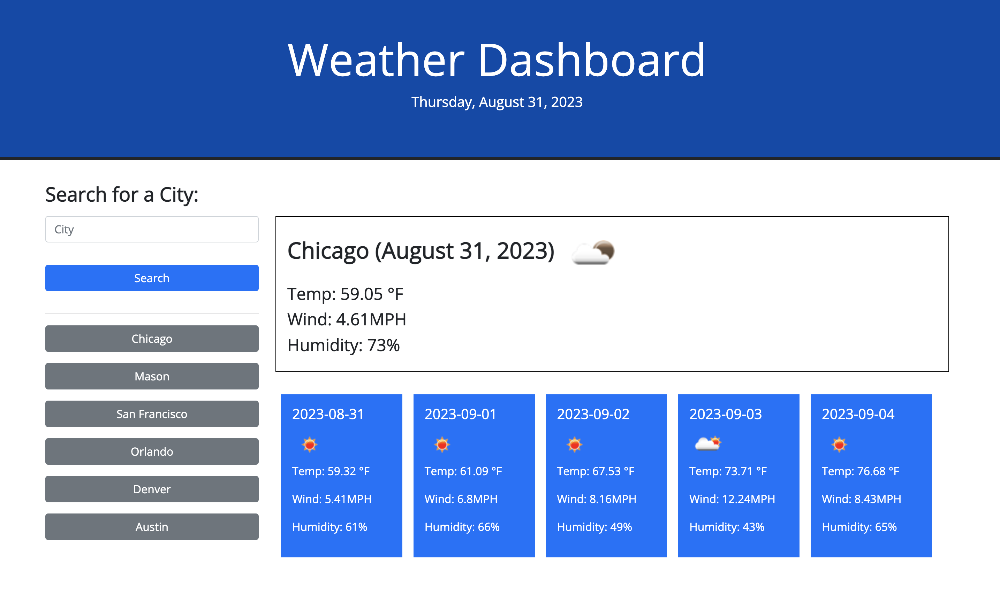

# weather-dashboard
Bootcamp Homework 6: Weather Dashboard (Server-Side APIs)

## Server-Side APIs Challenge: Weather Dashboard

In this project, we were asked to build a weather dashboard that will run in the browser and feature dynamically updated HTML and CSS.

On page load, the current date displays at the top of the page just below the app title. A user can enter a city in the search input box and when the search button is clicked, the application will query the Open Weather API and displays weather information plus the 5 day forecast for the city entered. Also, the value (city) entered by the user is saved in the local storage.

Also on page load, buttons for the recent cities searched will display below the search form. The data is fetched from the data stored in the local storage. If no data is stored, nothing displays below the search form.

## References/Resources

I used the following references/resources for this assignment:

**Open Weather API** (https://openweathermap.org/api) to retrieve weather data & 5 day forecast for cities.

**Javascript Libraries** such as **Day.js** (https://day.js.org/docs/en/display/format) and **momentjs** (https://cdnjs.cloudflare.com/ajax/libs/moment.js/2.24.0/moment.min.js). 

**JQuery package** (https://code.jquery.com/jquery-3.4.1.min.js)

**Bootstrap 5.0** (https://getbootstrap.com/docs/5.0/) 

**Google Fonts** (https://fonts.google.com/)

I mostly referred to our **HTML, CSS, and Javascript** lessons/activities for this assignment. 

## URLs submitted

My Repo URL: https://github.com/lenzlee/weather-dashboard

Application URL: https://lenzlee.github.io/weather-dashboard/

## My Application Screenshot

## Mockup Provided

